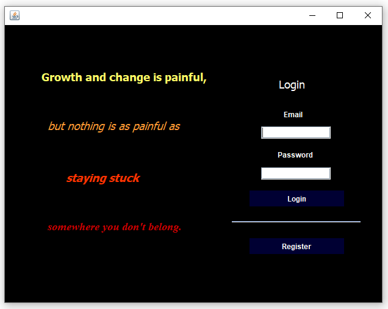
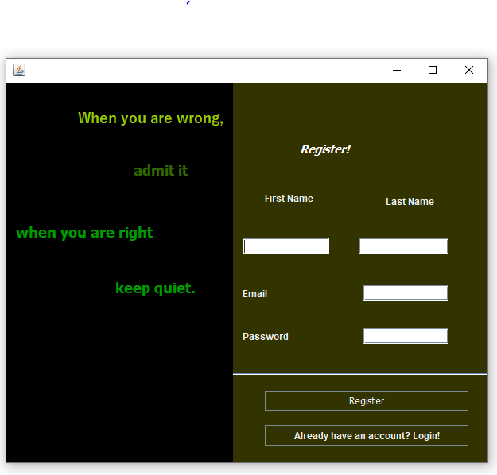
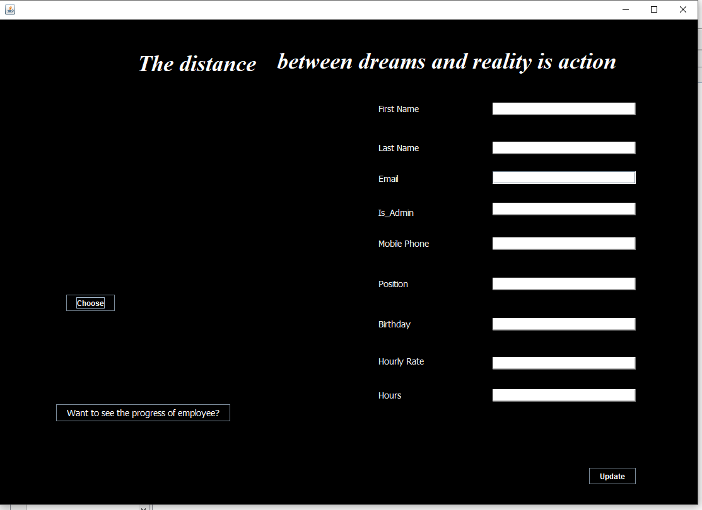
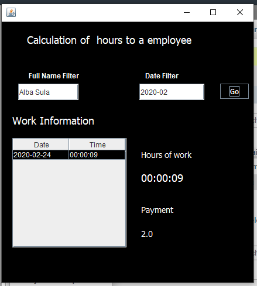
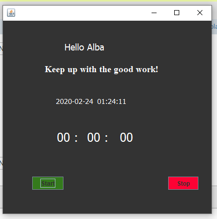

# Java Manager Application

This is an application that helps a company to manage their employers registration and worktime. The application has five interfaces:
- Login
- Register
- Admin
- WorkTime
- HourCalculation

## Login Page ##

This is the interface of the Login page. In this interface the employee can login or register if he/she has not been registered yet. 
The design is made to cheer the employee up with the quotes. The quote of Login page is:

**Growth and change is painful, but nothing is as painful as staying stuck somewhere you don't belong**

## Register Page ##

This is the interface of the Register page. In this interface the employee can register if he/she has not been registered yet. The initial registration will be dealt by admin, so that not everyone can actually register in the company employee database.
The design is made to cheer the employee up with the quotes. The quote of Register page is:

**When you are wrong admit it, when you are right keep quiet**

## Admin Page ##

This is the admin page and this is where the admin registers all new employees. Here the admin can see the progress of each employee too and that page is called HourCalculation Page.
The quote of the Admin Page is:

**The distance between dreams and reality is action**

## HourCalculation Page ##

In this page you can choose the employee that you what to see the progress and specify the month and the year too. It will not only show the hours worked by day and time by that employee for that month, but the total hours worked and how much he/she deserves as a payment untill now.

## WorkTime Page ##

This is what the employees need to activate in order to have their working hours registered in the database. All they need to do is to click start or stop in order to start or stop their work.
The message of this page is:

**Keep up with the good work**

